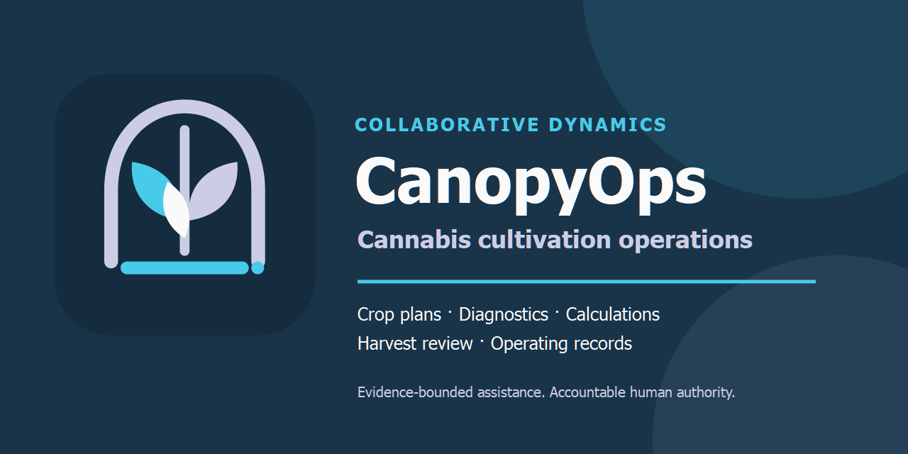
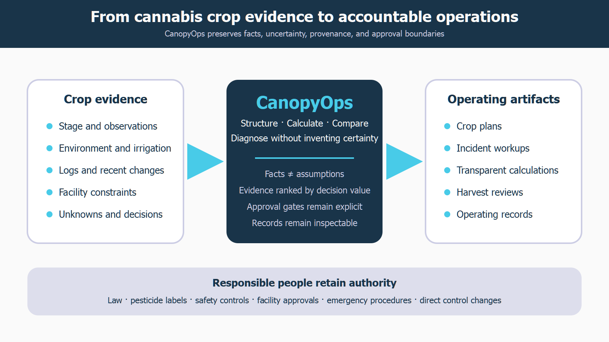

# CanopyOps

**Cannabis crop plans, diagnostics, and operating records.**

[](https://github.com/Stunspot/CanopyOps/actions/workflows/verify.yml)

The badge reports only the repository's deterministic GitHub Actions workflow. It does not establish live-host activation, cultivation-field fitness, official Plugins Directory appearance, or release approval.

CanopyOps is a Collaborative Dynamics agentic Augment SKILL that turns cannabis cultivation observations, logs, and facility constraints into defensible crop plans, incident workups, calculations, harvest reviews, compliance-verification briefs, runbooks, CAPA, and shift handoffs.

It is the reasoning-and-record layer between “something looks wrong” and an accountable operating decision. It helps make evidence, assumptions, uncertainty, authority, ownership, and follow-up visible. It does not pretend that AI can authorize pesticides, interpret local law, release inventory, or run a facility.

## Built with Codex and GPT-5.6 during OpenAI Build Week

CanopyOps was conceived and built on July 17, 2026, during the OpenAI Build Week submission period. Stun supplied compact product intent, source material, the Ella Greenfield persona, domain and authority boundaries, and release judgment. Codex with GPT-5.6 turned that direction into the routed SKILL, deterministic utilities, schemas, templates, evaluations, host adapters, documentation, licensing surfaces, plugin packaging, verification, and public release.

The working Augment emerged in roughly an hour; public packaging, branding, licensing, hardening, and publication continued afterward. This repository now includes a 17-test deterministic suite and automatic verification so judges and users can inspect the machinery rather than taking the claim on faith.

Read [BUILD-WEEK.md](BUILD-WEEK.md) for the architecture, provenance, human/AI responsibility split, and evidence. Judges can use [JUDGE-QUICKSTART.md](JUDGE-QUICKSTART.md) to install and test CanopyOps with fictional data in about five minutes.

## Install from GitHub

For the branded Codex plugin:

```text
codex plugin marketplace add Stunspot/CanopyOps
codex plugin add canopyops@collaborative-dynamics
```

Start a new Codex task after installation. Standalone Codex, Claude.ai custom-skill, Claude Code, download, update, and removal instructions are in [INSTALL.md](INSTALL.md).

## What you can do with it

- Build room and crop plans from facility limits, cultivar information, stage, targets, and measurement methods.
- Diagnose environmental, root-zone, irrigation, runoff, EC, pH, pest, disease, and crop-quality incidents without collapsing uncertainty into a pet theory.
- Calculate VPD, DLI, irrigation volumes, runoff, dryback, and normalized units with reproducible inputs and formulas.
- Review harvest readiness, drying conditions, quality evidence, and unresolved release holds.
- Turn observations into incident reports, CAPA, risk registers, room runbooks, crop walks, and shift handoffs.
- Verify proposed actions against current labels, SOPs, jurisdiction sources, laboratory evidence, and accountable-human authority.



## Start in ten minutes

1. Open [START-HERE.md](START-HERE.md).
2. Install CanopyOps using [INSTALL.md](INSTALL.md).
3. Give it a real or fictional room profile, crop observation, log excerpt, or proposed change.
4. Ask naturally, or begin with one of these:

> Build a cannabis crop plan from this room, cultivar, facility profile, and operating constraints. Separate supplied targets from approved active targets, show assumptions, and identify the decisions that still need an accountable owner.

> Diagnose this cannabis crop incident from my logs and observations. Start with the evidence, preserve competing explanations, recommend only reversible containment until the cause is supported, and produce an incident record with owners and verification conditions.

> Review this cannabis batch for harvest readiness. Separate measured evidence, interpretation, unresolved holds, and the human approvals required before any release decision.

## What it produces

CanopyOps works primarily in readable Markdown, CSV, and JSON. The package includes reusable templates for facility and crop profiles, crop plans, incident reports, harvest reviews, compliance verification, CAPA, risk registers, room runbooks, crop walks, drying logs, cultivation decisions, and shift handoffs.

See [EXAMPLE-TOUR.md](EXAMPLE-TOUR.md) for four worked demonstrations and links to their complete artifacts.

## Supported hosts

| Host | Status | Invocation |
|---|---|---|
| Codex plugin | Public GitHub installation verified | Install `canopyops@collaborative-dynamics`, then ask naturally. |
| Codex standalone skill | Packaged | Install the `canopyops/` directory as a personal skill. |
| Claude.ai custom skill | Portable ZIP packaged; live upload not yet recorded | Upload `claude-ai/canopyops-v0.1.5.zip` under **Customize > Skills**. |
| Claude Code | Structurally compatible; live host run not yet recorded | Install `canopyops/` under personal or project skills; invoke `/canopyops` or ask naturally. |
| Fileless chat | Degraded fallback | Load the skill, Ella persona, and active workflow manually; deterministic scripts and persistent artifacts are unavailable. |

Python 3 is optional. It enables deterministic calculations, normalization, linting, packaging, freshness checks, and schema-subset validation; the core reasoning workflow remains usable without it.

## Trust boundary

CanopyOps is advisory decision support for lawful cannabis cultivation operations. Facility SOPs, approved labels, current jurisdiction sources, laboratory results, equipment documentation, emergency procedures, and accountable humans remain authoritative.

Read [SAFETY-AND-SCOPE.md](SAFETY-AND-SCOPE.md) before operational use. In particular, CanopyOps will not place alarm bypass, occupied-space CO2 work, unapproved pesticide/PGR use, covert cultivation, enforcement evasion, extraction, medical advice, direct actuator commands, or unapproved batch release inside its recommendation space.

## Evidence and limitations

The v0.1.5 package passes the current Augment Builder Codex and Claude profiles plus the repository's deterministic release tests. The standalone, plugin, and Claude archive skill trees are byte-identical. A reviewed, context-only three-case safety/scope smoke completed 3/3 selected episodes in v0.1.2; that result remains inherited behavioral evidence because v0.1.5 changes documentation, release custody, listing identity, and regression checks rather than the operating kernel. It is evidence under those exact recorded conditions, not field validation or a reliability guarantee.

Field use, broader behavioral consistency, current jurisdiction coverage, live Claude.ai or Claude Code execution, equipment integration, and official OpenAI Plugins Directory appearance remain unverified or outside v0.1.5. See [RELEASE-NOTES-v0.1.5.md](RELEASE-NOTES-v0.1.5.md).

The exact v0.1.5 checks and their evidence boundaries are recorded in [VERIFICATION-v0.1.5.md](VERIFICATION-v0.1.5.md).

## License and identity

The authentic unmodified authored CanopyOps Augment may be used and commercially redistributed with attribution under `CC-BY-ND-4.0`. Python scripts, tests, and machine-readable schemas use MIT. The trademark policy permits another product to include and accurately identify **CanopyOps by Collaborative Dynamics** without rebranding it or implying endorsement.

See [LICENSE.md](LICENSE.md), [TERMS-OF-USE.md](TERMS-OF-USE.md), [ATTRIBUTION.md](ATTRIBUTION.md), and [TRADEMARKS.md](TRADEMARKS.md).

## About

CanopyOps is a Collaborative Dynamics Augment created by Sam Walker (stunspot), with the Ella Greenfield cultivation persona operating inside an evidence-bounded legal-market system.

- [Start here](START-HERE.md)
- [Build Week provenance](BUILD-WEEK.md)
- [Judge quickstart](JUDGE-QUICKSTART.md)
- [Install](INSTALL.md)
- [Examples](EXAMPLE-TOUR.md)
- [FAQ](FAQ.md)
- [Support](SUPPORT.md)
- [Security](SECURITY.md)
- [Verification](VERIFICATION-v0.1.5.md)
- [Contributing](CONTRIBUTING.md)
- [Data and privacy](DATA-AND-PRIVACY.md)
- [Terms of use](TERMS-OF-USE.md)
- [Current release notes](RELEASE-NOTES-v0.1.5.md)
- [Archive custody](ARCHIVE-CUSTODY.md)
- [Previous release notes](RELEASE-NOTES-v0.1.3.md)
